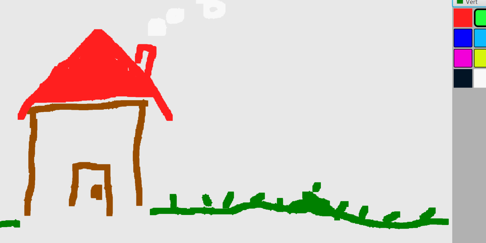
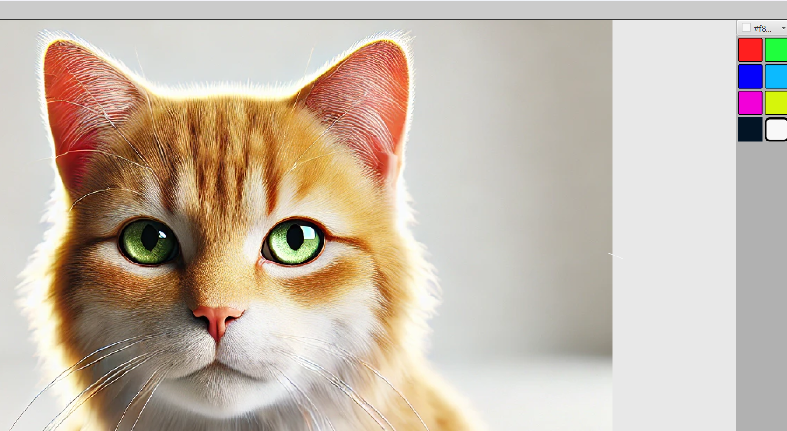

# Gribouille

Gribouille est une application de dessin développée en Java utilisant la bibliothèque JavaFX. Ce projet propose une interface de type Paint permettant de créer des illustrations numériques avec une palette de couleurs prédéfinies et une fonctionnalité d'exportation d'image.

---

## Fonctionnalités

* **Outil de dessin libre** : Tracé fluide à la souris.
* **Palette de couleurs** : Accès rapide à plusieurs teintes (rouge, vert, bleu, rose, jaune, noir, blanc).
* **Exportation** : Possibilité d'enregistrer vos créations au format image.
* **Interface épurée** : Panneau latéral pour les outils afin de maximiser l'espace de dessin.

---

## Aperçus du projet

### Interface et dessin de base


### Exemple de rendu détaillé


---

## Technologies utilisées

* **Langage** : Java
* **Interface Graphique** : JavaFX
* **Gestion d'image** : ImageIO / PixelReader pour l'exportation

---

## Installation et utilisation

1. Cloner le dépôt :
   ```bash
   git clone [https://github.com/m-degroux/Gribouille.git](https://github.com/m-degroux/Gribouille.git)